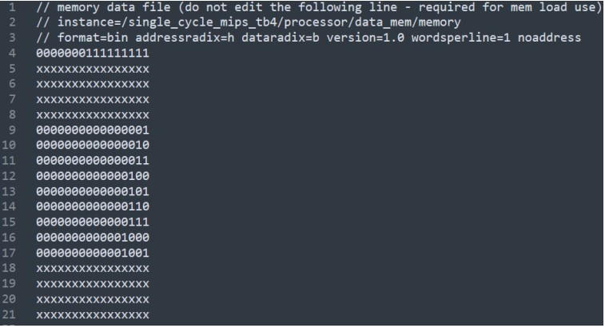

# General  
- Single Cycle MIPS 16-bit Processor designed in Verilog HDL.  
- Instructions are 32 bits long, register contents are 16 bits long.  
- Data memory holds 2^16 words of data.  
- Instruction memory holds 1024 instructions.  

## Testing  
1- Open QAR  
2- Analysis and Synthesis  
3- Run RTL Simulation  
4- After running the simulation, simulation directory is created. After that all files(.mem) in the "initalization_files" directory must be moved to the "simulation/modelsim" directory that is created after running the RTL Simulation. If it is not done, modelsim cannot see the initialization file for that particular test.  
5- Test Benches can be runnable.  
  
## Adding New Tests
1- Adding with assembly code:  
   - Use assembler.py to generate machine code from assembly code, then move the generated .mem file to the "simulation/modelsim" directory in the restored directory, then initalize it in the test bench.  

2- Adding with machine code:  
   - Add the .mem file directly to the "simulation/modelsim" directory in the restored directory similar to the other test benches.  

## Example Test

### Assembly Code and Generated Machine Code:

  
### Registers:

  
### Data Memory:

  
### Waveforms:
  

  

- Other tests and results can be found in the documentation.

